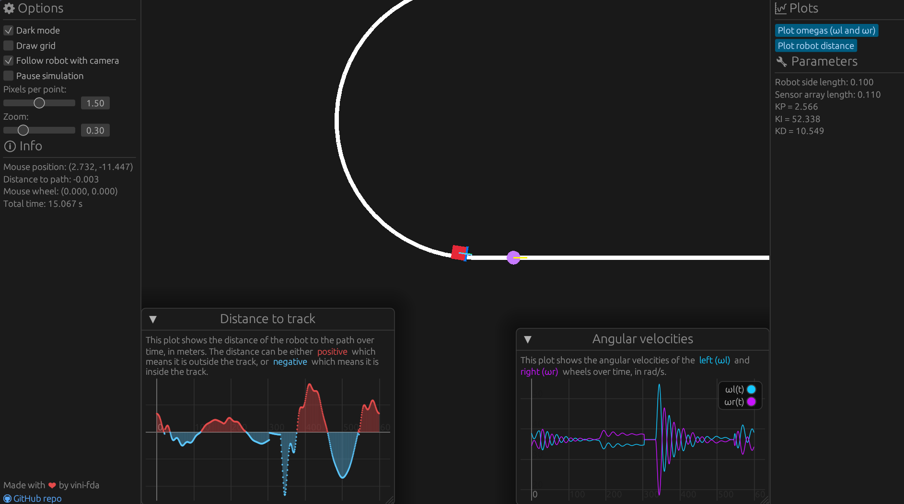

# line-follower-rs

There are two binaries in this Cargo project:

- `line_follower_gui`: the simulation with a graphical interface
- `line_follower_cli`: a CMA-ES-based optimization algorithm to find the best controller parameters (Kp, Ki, Kd and speed) for the robot

## `line_follower_gui`

This is a simple simulation of a line follower robot. The robot is controlled by a feedback controller that uses the light sensors to detect the line. The robot is placed on a track, which is a smooth curve. It is controlled by a two-wheel differential drive (TWD), which means that it can move in a straight line if the wheels are moving at the same speed and make a turn if the wheels are moving at different speeds.

Here's an image of the simulation:

## TODO

## Graphics

- [x] Add the graphical representation of the robot
  - [x] Initially, just a simple rectangle with indicators for the sensors (front)
- [x] Implement a simple library for the geometry of the track
- [x] Map simulation units to graphics/screen-space units
  - [x] Simulation units should be, by default, equal to the real-world units in SI (i.e. 1 simulation unit = 1 meter)
  - [ ] When showing the simulation, a grid could have axes with configurable real-world units (i.e. 1 meter = 1 grid unit)
- [x] Add a camera to the simulation
  - [x] Add zoom and pan
  - [x] Add a grid with world coordinates (can be toggled)

## Simulation

### General aspects

- [x] Implement a simple library for the simulation of the robot
  - [x] Needs a stable integration scheme
    - [x] Needs a way to specify the robot's dynamics, i.e. the equations of motion in terms of the parameters of the robot (mass, inertia, etc.)
    - [x] State-space representation is ideal
  - [ ] The time step should be configurable (and could be smaller than the graphics time step, so that the simulation is more accurate)
- [ ] Simulation must be decoupled from the graphics
  - [ ] We may want to run the simulation at a higher frequency than the graphics, possibly without displaying the graphics at all

### Robot

- [x] There should be a discrete amount of light sensors (say, 7) to indicate how far off the line it is
- [ ] There should be an encoder to measure the angular velocity of the robot's wheels
  - The scalar velocity of the robot can be calculated from the angular velocity of the wheels and the radius of the wheels under the no-slip condition
- [x] There are two wheels on the robot, which can be controlled independently
  - This can create a differential drive robot, which moves in a straight line if the wheels are moving at the same speed and makes a turn if the wheels are moving at different speeds
- [x] The robot will implement some sort of controller
  - [x] The controller will follow a feedback control scheme using sensor data
  - [x] The controller must be discretized using a state-space representation
    - [ ] As *extra* work, we could treat the controller sample frequency as different from the simulation frequency

### Track

- [x] The track is just a collection of points
  - [x] The track should be closed, i.e. the last point should be connected to the first point
  - [x] The track should be a smooth curve
- [x] Create auxiliary library to implement arcs and straight lines

## GUI

- [x] Add elements to control the simulation
  - [x] Add a button to start/stop the simulation
  - [ ] Add a button to reset the simulation
  - [ ] Add a slider to control the speed of the simulation
- [ ] Plot the robot's orientation (angle) and error (detected by the sensors) in real-time graphs
  - Remember that the output data of the simulation is decoupled from the graphics, so we can plot the data without having to display the graphics
